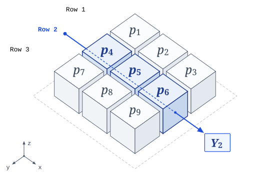
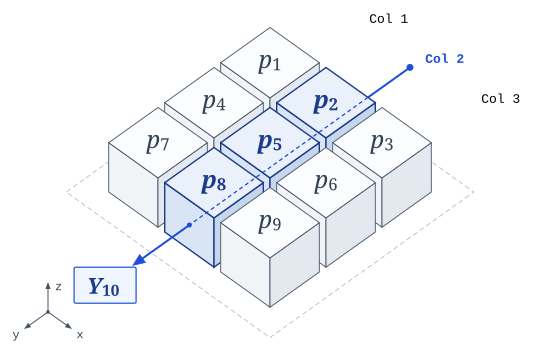

# Poisson Reconstruction for Medical Imaging

**Authors:** Yong-Hwan Lee and Tony Storey

**Course:** ECE565 — Estimation, Filtering and Detection

A nine-parameter tomography study of Poisson maximum likelihood, expectation maximization (EM), Fisher information, and gain-dependent estimation error.

**Read the revised [technical report](Medical_Imaging.pdf)** · [LaTeX source](Medical_Imaging.tex) · [original report](report/legacy/Medical_Imaging_original.pdf)

The report has been rebuilt with typeset derivations, vector diagrams, seeded numerical experiments, and an implementation audit. Its quantitative figures come from the reproducible Python supplement described below.

## Repository map

| Path | Role |
| --- | --- |
| [Medical_Imaging.pdf](Medical_Imaging.pdf), [Medical_Imaging.tex](Medical_Imaging.tex) | Revised report and its standalone LaTeX source |
| [report/scripts/reproduce.py](report/scripts/reproduce.py) | Python/NumPy Monte Carlo supplement behind the report's numbers |
| [report/data/](report/data/) | Committed outputs of the recorded supplement run |
| [report/legacy/Medical_Imaging_original.pdf](report/legacy/Medical_Imaging_original.pdf) | Original Word-exported report |
| [main.m](main.m), [EM_algorithm.m](EM_algorithm.m), [CRLB.m](CRLB.m), [random_model.m](random_model.m) | Legacy MATLAB experiment (see [below](#legacy-matlab-implementation)) |
| [images/](images/) | Voxel diagrams and legacy figures |

If you are new to the project, start with the report. To check its numbers, see [Reproduce the revised experiment](#reproduce-the-revised-experiment).

## Scope

The estimator uses the **linear Poisson intensity model**

$$
Y_i \sim \mathrm{Poisson}((Ax)_i), \qquad x \geq 0.
$$

This is an educational inverse problem with the additive structure used in emission imaging. It is not a calibrated transmission X-ray CT model. Ideal transmission counts instead have a mean of the form

$$
\bar y_i = I_{0,i}\exp\left(-\sum_j l_{ij}\alpha_j\right)+r_i.
$$

Here, $\alpha_j$ denotes attenuation; the linear model's $x_j$ denotes intensity. Taking logarithms does not make noisy transmission data Poisson with a linear mean. The experiment uses a synthetic 3 × 3 field and establishes no clinical image-quality or dose-reduction claim.

## Geometry and observations

The fixed sensing matrix has 16 measurements and nine parameters, with full column rank. Pixels are numbered row by row. For example,

$$
\mathbb E[Y_2]=x_4+x_5+x_6, \qquad
\mathbb E[Y_{10}]=x_2+x_5+x_8.
$$

<p align="center">


</p>

These diagrams illustrate the predefined matrix in [main.m](main.m). The legacy MATLAB script subsequently replaces that matrix using [random_model.m](random_model.m). The revised report supplement deliberately keeps the predefined matrix fixed.

## Likelihood and EM

For independent observations, the observed log likelihood is

$$
\ell(x;y)=\sum_i\left[y_i\log(Ax)_i-(Ax)_i-\log\Gamma(y_i+1)\right].
$$

Maximizing it is equivalent to minimizing the generalized KL divergence

$$
D(y\Vert Ax)=\sum_i\left[y_i\log\frac{y_i}{(Ax)_i}-y_i+(Ax)_i\right].
$$

Introduce independent hidden counts $N_{ij}\sim\mathrm{Poisson}(a_{ij}x_j)$ with $Y_i=\sum_jN_{ij}$. Their conditional expectations give the E step,

$$
\mathbb E[N_{ij}\mid Y_i=y_i,x^{(t)}]
=\frac{y_i a_{ij}x_j^{(t)}}{(Ax^{(t)})_i}.
$$

The M step yields

$$
x^{(t+1)}=x^{(t)}\odot
\frac{A^{\mathsf T}\left(y/(Ax^{(t)})\right)}{A^{\mathsf T}\mathbf 1}.
$$

Multiplication and division are elementwise where indicated. Start strictly positively, require nonzero column sensitivities, and treat zero counts explicitly. An exact EM update makes the likelihood nondecreasing; it does not guarantee a monotone decrease in reconstruction error.

## Fisher information and error scale

At positive means,

$$
\mathcal I_x(x)=A^{\mathsf T}\mathrm{diag}\left(1/(Ax)_i\right)A.
$$

The ordinary Cramér–Rao covariance bound applies to unbiased estimators under regularity conditions. A nonnegative finite-iteration estimator can be biased, so its MSE is compared with this bound as a reference.

For $x=gb$, error is reported on the base-intensity scale, using $\widehat b=\widehat x/g$. Both the parameter MSE and the true-parameter CRLB are divided by the **actual gain squared**. This normalized reference scales as $1/g$.

## Reproduce the revised experiment

Requirements: Python 3 and NumPy; nothing else is needed. According to `results.json`, the recorded run used Python 3.12.14 and NumPy 2.3.5.

```bash
python3 report/scripts/reproduce.py --trials 10000 --iterations 1000 --seed 20260929
```

These values are also the script's defaults, and `--help` lists the three options:

- `--trials`: independent Poisson data sets drawn per gain (at least 2).
- `--iterations`: EM updates applied to each data set (at least 1).
- `--seed`: seed for `numpy.random.default_rng`.

The study uses the predefined 16 × 9 matrix, base vector `[120, 240, 360, 180, 720, 300, 90, 420, 540]`, gains `[0.1, 1, 5, 10]`, and NumPy's PCG64 generator. Each gain has 10,000 independent Poisson trials. Initialization is a least-squares solve clipped elementwise to at least `1e-8`; no floor is added during EM updates.

The script checks likelihood ascent at every update, a noiseless fixed point, and agreement between scalar and vectorized EM formulas. If any check fails, it stops with an `AssertionError`. It prints a console summary, including the elapsed time, and writes:

- [results.json](report/data/results.json): settings, matrix, metrics, bias–variance decomposition, and diagnostics.
- [summary.csv](report/data/summary.csv): results at 0, 20, 200, and 1,000 updates.
- [trace.csv](report/data/trace.csv): every iteration for the first trial at gain one.

**Outputs overwrite the committed data.** The script always writes to the `data/` directory beside its own `scripts/` directory, whatever the current working directory, and it has no option to redirect output. Repeated runs in the same numerical environment with the same seed and settings are intended to reproduce the output. Python and NumPy versions are recorded in the JSON, and changing versions or numerical libraries can change metadata or floating-point results. Elapsed time goes only to the console. Different simulation settings replace the recorded results and appear under `nondefault_settings`. For a quick smoke test that leaves the committed data alone, run a disposable copy from the repository root:

```bash
ct_smoke_dir=$(mktemp -d)
mkdir -p "$ct_smoke_dir/report/scripts"
cp report/scripts/reproduce.py "$ct_smoke_dir/report/scripts/"
python3 "$ct_smoke_dir/report/scripts/reproduce.py" --trials 4 --iterations 3 --seed 20260929
```

That run writes to `$ct_smoke_dir/report/data/`. This small command passed the script's self-tests and likelihood checks during documentation validation; it does not reproduce the 10,000-trial result table. The full run keeps a 10,000 × 16 batch in memory per gain and takes noticeably longer.

After 1,000 updates, the normalized MSE and true-parameter reference are:

| Gain | MSE / gain² | 95% Monte Carlo interval | CRLB / gain² | MSE / CRLB |
| ---: | ---: | :---: | ---: | ---: |
| 0.1 | 2,106.72 | [2,084.11, 2,129.34] | 2,110.20 | 0.9984 |
| 1 | 210.66 | [208.43, 212.89] | 211.02 | 0.9983 |
| 5 | 42.49 | [42.05, 42.94] | 42.20 | 1.0069 |
| 10 | 21.16 | [20.94, 21.39] | 21.10 | 1.0029 |

Each interval is the MSE ± 1.96 Monte Carlo standard errors (`mse_base_units_mcse` in `summary.csv`). Intervals quantify simulation uncertainty in the average MSE, not uncertainty in individual pixels. Proximity to the reference does not establish unbiasedness or efficiency. These are new controlled results, not recovered measurements from the original figures.

## Legacy MATLAB implementation

The historical `.m` files are preserved. Run `main.m` in MATLAB with Statistics and Machine Learning Toolbox for its random-number functions, but account for the issues documented in the report before interpreting the original plots:

- The random sensing matrix and base vector are unseeded; full rank is not checked.
- Unconstrained least-squares initialization may produce negative coordinates.
- Gain normalization uses the loop index `gain_val`, rather than `gain(gain_val)`.
- The information matrix is evaluated at the estimate rather than the true parameter.
- The likelihood uses a Stirling expression that needs a zero-count convention.
- The gain plot uses point indices rather than the actual gain values.

The original PDF describes 200 Monte Carlo runs and gain 0.1–100; the checked-in code specifies 10,000 runs and gains `[0.1, 1, 5, 10]`. The revised report explicitly separates that historical material from its new experiment.

## Editing the report

[Medical_Imaging.tex](Medical_Imaging.tex) is standalone: the vector diagrams and numerical plot coordinates are embedded, and it does not read `report/data/`. Compile it with a standard LaTeX toolchain or Tectonic.

Nothing updates the report or `Medical_Imaging.pdf` automatically. After rerunning a modified experiment:

1. Run `reproduce.py` with the new settings, which overwrites `report/data/`.
2. Copy the new values from `summary.csv`, `trace.csv`, and `results.json` into the embedded plot coordinates, the tables, and the narrative in the `.tex` file, and update them together.
3. Recompile the PDF and commit it alongside the updated source and data. This README's results table also needs to change.

The original Word-exported PDF is preserved in [report/legacy](report/legacy/).

## References

1. A. P. Dempster, N. M. Laird, and D. B. Rubin. “Maximum likelihood from incomplete data via the EM algorithm.” *JRSS Series B*, 39(1), 1–22, 1977. [DOI](https://doi.org/10.1111/j.2517-6161.1977.tb01600.x).
2. L. A. Shepp and Y. Vardi. “Maximum likelihood reconstruction for emission tomography.” *IEEE Transactions on Medical Imaging*, 1(2), 113–122, 1982. [DOI](https://doi.org/10.1109/TMI.1982.4307558).
3. E. A. Rashed and H. Kudo. “Towards high-resolution synchrotron radiation imaging with statistical iterative reconstruction.” *Journal of Synchrotron Radiation*, 20(1), 116–124, 2013. [DOI](https://doi.org/10.1107/S0909049512041301).
4. Q. Ding, Y. Long, X. Zhang, and J. A. Fessler. “Statistical image reconstruction using mixed Poisson–Gaussian noise model for X-ray CT.” 2018. [arXiv](https://arxiv.org/abs/1801.09533).
